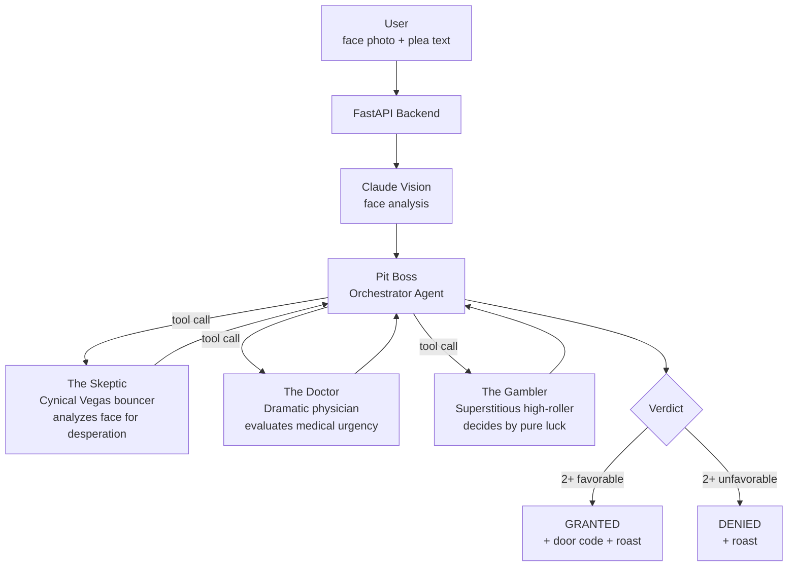

# Lucky Loo — The High-Stakes Restroom Finder

> "Because in Vegas, even a flush is a gamble."

A hackathon project demonstrating multi-agent AI orchestration. Users must convince an AI jury of their bathroom desperation — combining computer vision, text analysis, and pure luck — to unlock access.


Built for the **AWS "Road to re:Invent" Hackathon**.

---

## Demo
https://github.com/user-attachments/assets/530e1075-2d40-4e7e-9bdd-ef8f043a0a92

---

## The Concept

A crowdsourced bathroom finder that gatekeeps toilet access behind an AI "Court of Relief." Three juror agents deliberate your case, and a judge delivers the final verdict: **GRANTED** or **DENIED**.

The twist: it's intentionally over-engineered. A simple problem solved with computer vision, multi-agent orchestration, and Vegas casino aesthetics.

---

## Agent Architecture



---

## The "Agents-as-Tools" Pattern

Child agents are wrapped as tools for the parent orchestrator — a hierarchical delegation pattern using the [Strands Agents SDK](https://github.com/strands-agents/sdk-python).

```python
# 1. Define child agents with distinct personalities
juror_skeptic = Agent(
    model=bedrock_model,
    system_prompt=load_steering_prompt("juror_skeptic.md")
)

# 2. Wrap as tools
@tool
def consult_skeptic(face_analysis: str) -> str:
    return str(juror_skeptic(face_analysis))

# 3. Orchestrator calls tools autonomously
pit_boss = Agent(
    tools=[consult_skeptic, consult_doctor, consult_gambler],
    system_prompt=load_steering_prompt("judge_pitboss.md")
)

# 4. Run deliberation
verdict = pit_boss(case_presentation)
```

---

## The Jury

All personalities are defined in markdown steering files (`backend/steering/`):

| Agent | Role | Decision Logic |
|-------|------|---------------|
| **The Skeptic** | Cynical Vegas bouncer | Claude Vision analyzes face for genuine desperation vs. acting |
| **The Doctor** | Overly dramatic physician | Text analysis for medical urgency keywords and desperation signals |
| **The Gambler** | Superstitious high-roller | Pure randomness with gambling metaphors |
| **The Pit Boss** | Orchestrator / Judge | Weighs all three votes, delivers final verdict + roast |

---

## Tech Stack

**Backend:** Python 3.11 · FastAPI · Strands Agents SDK · AWS Bedrock (Claude Haiku 4.5) · boto3  
**Frontend:** React 19 · Vite 5 · Tailwind CSS · react-webcam · react-confetti  
**AI:** Claude Haiku 4.5 (text + vision) · Agents-as-Tools pattern  
**Auth:** EC2 IAM role (no API keys needed)

---

## Quick Start

### Prerequisites
- Python 3.10+
- Node.js 18+
- AWS credentials with Bedrock access (Claude Haiku 4.5 enabled in us-east-1)

### Backend
```bash
cd backend
python -m venv venv && source venv/bin/activate
pip install -r requirements.txt
uvicorn app:app --host 0.0.0.0 --port 8000
```

### Frontend
```bash
cd frontend
npm install
npm run dev
```

Open `http://localhost:3000`

### No AWS? Use mock mode
```bash
# backend/.env
MOCK_MODE=true
```

---

## API

### `POST /api/judge`
```json
// Request
{
  "plea": "PLEASE! I've been holding it for 3 hours!!",
  "image_base64": "<base64_jpeg>",
  "demo_mode": false
}

// Response
{
  "verdict": "GRANTED",
  "reasoning": "The Skeptic detected genuine terror...",
  "roast": "Jackpot, kid. Door code: 777.",
  "jury_votes": {
    "skeptic": "REAL",
    "doctor": "CRITICAL",
    "gambler": "IN"
  }
}
```

### `POST /api/demo`
Always grants access — use for presentations without AWS calls.

---

## Project Structure

```
.
├── backend/
│   ├── app.py              # FastAPI endpoints
│   ├── agents.py           # Agent orchestration + tools
│   ├── vision.py           # Claude Vision integration
│   ├── mock_responses.py   # Offline test data
│   ├── requirements.txt
│   └── steering/
│       ├── judge_pitboss.md
│       ├── juror_skeptic.md
│       ├── juror_doctor.md
│       └── juror_gambler.md
└── frontend/
    ├── src/
    │   ├── App.jsx         # Stage-based UI flow
    │   └── index.css
    └── vite.config.js
```

---

## License

MIT License — see [LICENSE](LICENSE)
